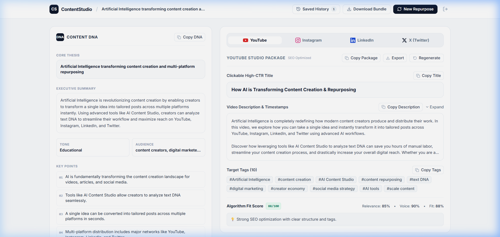
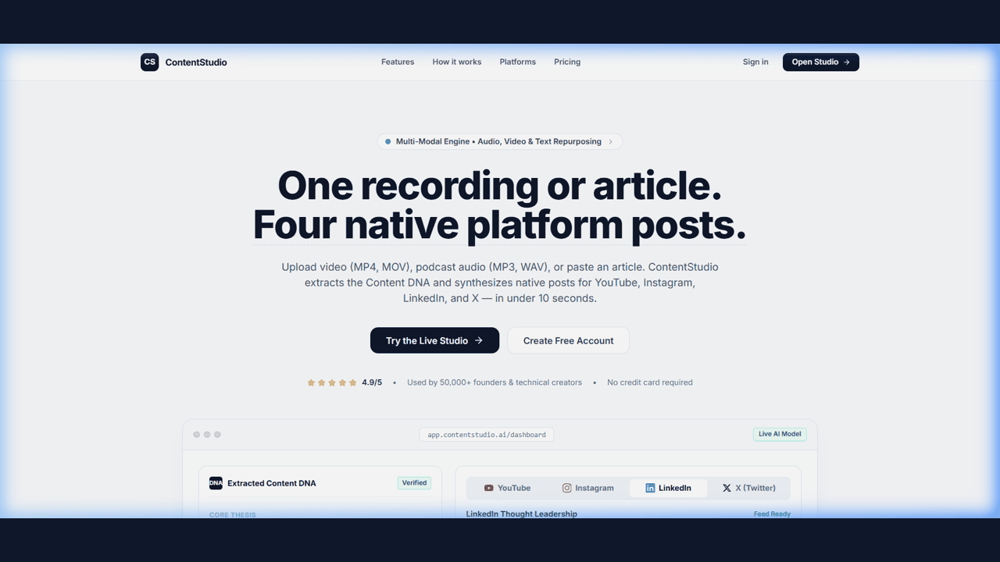

# AI Content Studio 🎬

[](https://fastapi.tiangolo.com/)
[](https://react.dev/)
[](https://www.typescriptlang.org/)
[](https://tailwindcss.com/)
[](https://aistudio.google.com/)
[](https://openai.com/)
[](./LICENSE)

> **Transform raw text, audio uploads, or YouTube links into platform-optimized social media posts — one input, four platforms, instant AI results.**

---



### 🎬 Interactive Demo Walkthrough


---

## ✨ Features

- 🧬 **Content DNA Engine** — Extracts key topic, concise summary, target audience, emotional hook, core takeaways, and SEO keywords from any input.
- 📲 **Multi-Platform Generation** — Instantly generates tailored content for:
  - 📹 **YouTube**: Title, full description, tags, and structured video script outline.
  - 📸 **Instagram**: High-converting hook, caption, hashtag group, and reel concepts.
  - 💼 **LinkedIn**: Thought leadership post, actionable key points, and professional hashtags.
  - 🐦 **X (Twitter)**: Single viral tweet and multi-tweet storytelling thread.
- 🎙️ **Audio/Video & YouTube Transcription** — Accepts raw text input, file uploads (`.mp3`, `.wav`, `.mp4`, `.mov`, `.webm`), or YouTube video links.
- 🎯 **Quality & Relevance Scoring** — Analyzes relevance, platform fit, and tone consistency for generated outputs.
- 🔄 **Iterative Regeneration** — Fine-tune and regenerate output for any individual platform with custom instructions.

---

## 📁 Repository Architecture

```
hackathon/
├── docs/                        # Project media & documentation assets
│   └── demo.png                 # App banner / showcase graphic
│
├── backend/                     # FastAPI Backend Service (Python)
│   ├── main.py                  # API routes, CORS setup & lifecycle handlers
│   ├── ai_service.py            # Gemini & OpenAI provider abstraction logic
│   ├── transcription.py         # Audio/Video & YouTube URL transcription service
│   ├── prompts.py               # Prompt engineering templates for Content DNA & platforms
│   ├── models.py                # Pydantic request & response schemas
│   ├── requirements.txt         # Pinned Python dependencies
│   ├── .env.example             # Backend environment template
│   └── .gitignore               # Backend specific exclusions
│
└── frontend/                    # Vite + React + TypeScript + Tailwind CSS Frontend
    ├── src/
    │   ├── App.tsx              # Core app container & routing logic
    │   ├── api.ts               # Axios/Fetch API client functions
    │   ├── types.ts             # TypeScript interfaces & types
    │   ├── components/          # Reusable UI component modules
    │   │   ├── ContentDNACard.tsx
    │   │   ├── PlatformCards.tsx
    │   │   ├── PlatformTabs.tsx
    │   │   ├── QualityScoreCard.tsx
    │   │   ├── CopyButton.tsx
    │   │   └── LoadingStates.tsx
    │   └── pages/               # Application views (Landing, Dashboard, Auth)
    ├── package.json             # Frontend dependencies & build scripts
    ├── vite.config.ts           # Vite bundler configuration
    ├── tailwind.config.js       # Tailwind CSS theme configuration
    ├── .env.example             # Frontend environment template
    └── .gitignore               # Frontend specific exclusions
```

---

## ⚡ Quick Start

### Prerequisites
- **Node.js** v18.0+ & `npm`
- **Python** 3.10+
- **Google Gemini API Key** (Free tier via [Google AI Studio](https://aistudio.google.com/app/apikey)) or **OpenAI API Key**

---

### 1. Backend Setup

```bash
# Navigate to backend directory
cd backend

# Create Python virtual environment
python -m venv venv

# Activate virtual environment
# Windows (PowerShell):
.\venv\Scripts\Activate.ps1
# Mac / Linux:
source venv/bin/activate

# Install dependencies
pip install -r requirements.txt

# Create environment configuration
cp .env.example .env
```

Edit `backend/.env` to configure your AI provider and API key:
```env
AI_PROVIDER=gemini
GOOGLE_API_KEY=your_gemini_api_key_here
FRONTEND_URL=http://localhost:5173
```

**Start the API Server:**
```bash
python main.py
# Server runs at: http://localhost:8000
# Interactive API Docs: http://localhost:8000/docs
```

---

### 2. Frontend Setup

```bash
# Open a new terminal and navigate to frontend directory
cd frontend

# Install Node dependencies
npm install

# Create environment configuration
cp .env.example .env

# Start Development Server
npm run dev
# App runs at: http://localhost:5173
```

---

## ⚙️ Environment Variables

### Backend (`backend/.env`)

| Variable | Default | Description |
|---|---|---|
| `AI_PROVIDER` | `gemini` | AI Provider choice (`gemini` or `openai`) |
| `GOOGLE_API_KEY` | — | Google Gemini API Key |
| `OPENAI_API_KEY` | — | OpenAI API Key (if using OpenAI) |
| `GEMINI_MODEL` | `gemini-1.5-flash` | Gemini model name |
| `OPENAI_MODEL` | `gpt-4o` | OpenAI model name |
| `FRONTEND_URL` | `http://localhost:5173` | Allowed CORS frontend origin |

### Frontend (`frontend/.env`)

| Variable | Default | Description |
|---|---|---|
| `VITE_API_URL` | `http://localhost:8000` | Backend API Base URL |

---

## 📡 API Reference

### `GET /health`
Returns system status and active AI provider.

### `POST /api/analyze`
Generates Content DNA and output for all 4 social media platforms.
- **Request Body:** `{ "content": "Your raw text content..." }`

### `POST /api/regenerate`
Regenerates a single platform output with optional custom prompt instructions.
- **Request Body:** `{ "platform": "instagram", "content_dna": {...}, "instructions": "Make it more professional" }`

### `POST /api/transcribe`
Uploads an audio or video file (`mp3`, `wav`, `mp4`, `mov`, `webm`, etc., max 25MB) and converts it to text.
- **Form Data:** `file: UploadFile`

### `POST /api/transcribe-url`
Extracts transcript/captions from a YouTube or media URL.
- **Request Body:** `{ "url": "https://www.youtube.com/watch?v=..." }`

---

## 🛠️ Tech Stack

| Domain | Tools & Technologies |
|---|---|
| **Frontend Framework** | React 19, TypeScript, Vite |
| **Styling & UI** | Tailwind CSS v3, Lucide Icons, Radix UI Primitives |
| **Backend Framework** | FastAPI, Python 3.11+, Uvicorn |
| **AI Integration** | Google Generative AI SDK, OpenAI API Client |
| **Data Validation** | Pydantic v2 |
| **HTTP Clients** | Fetch API (Frontend), HTTPX (Backend) |

---

## 🚀 Deployment Guide

### Deploying Backend (Render / Railway / Fly.io)
1. Set Build Command: `pip install -r requirements.txt`
2. Set Start Command: `uvicorn main:app --host 0.0.0.0 --port $PORT`
3. Configure environment variables (`AI_PROVIDER`, `GOOGLE_API_KEY`, `FRONTEND_URL`).

### Deploying Frontend (Vercel / Netlify)
1. Set Framework Preset: `Vite`
2. Set Build Command: `npm run build`
3. Set Output Directory: `dist`
4. Set Environment Variable: `VITE_API_URL=https://your-backend-domain.com`

---

## 📜 License

Distributed under the MIT License. See [`LICENSE`](./LICENSE) for more information.
